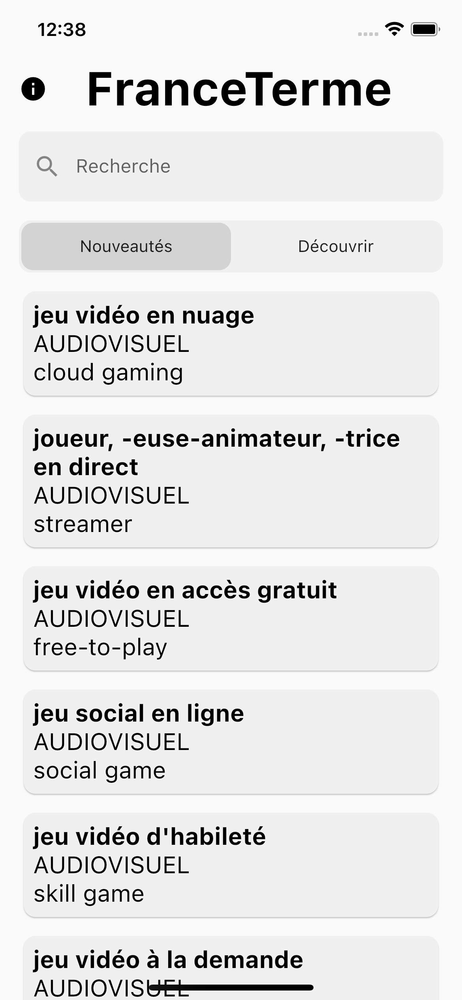
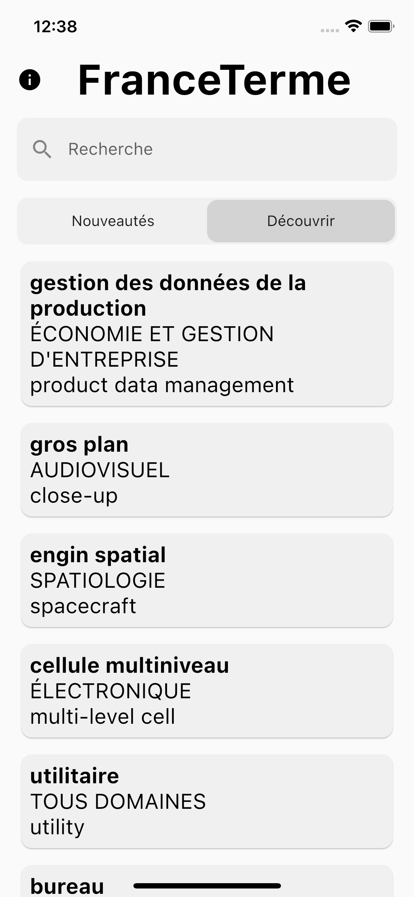
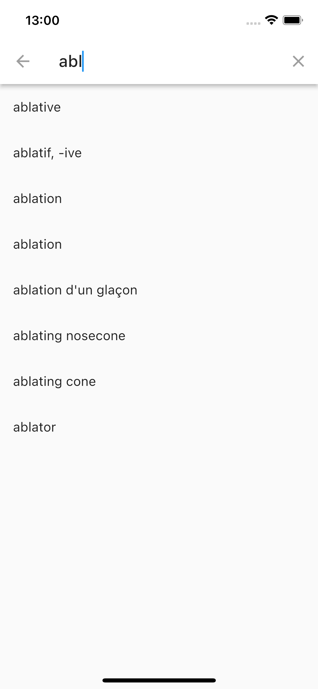
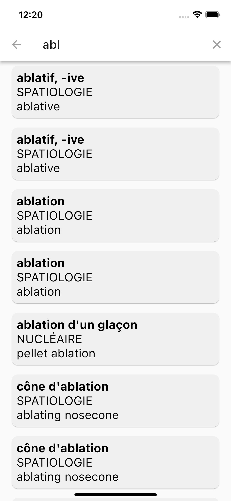
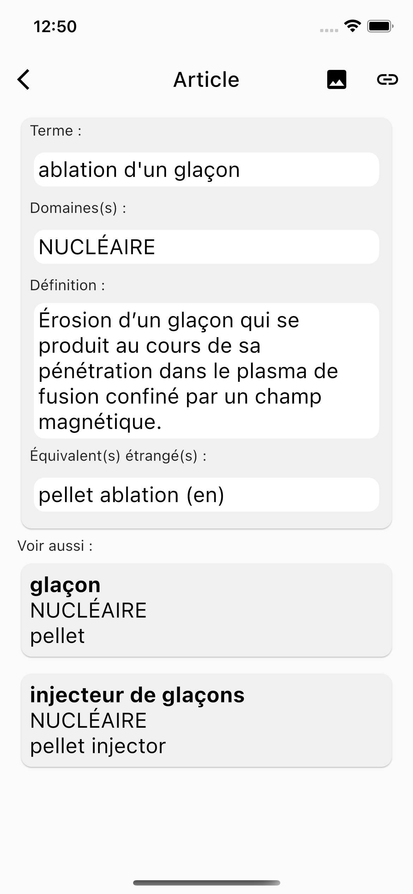
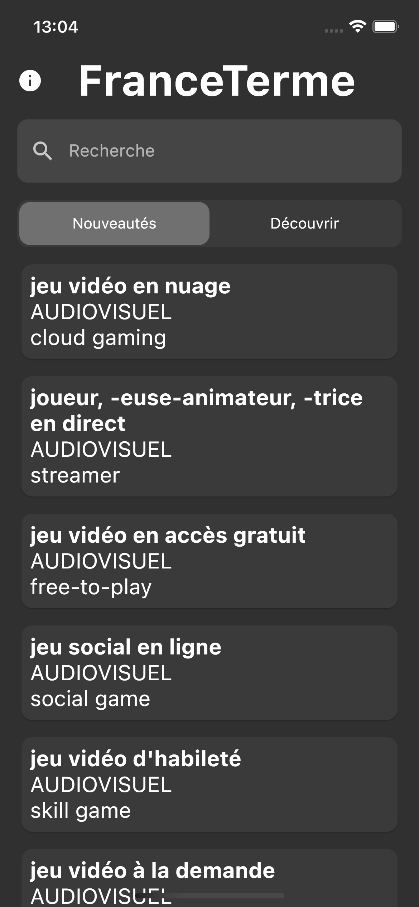
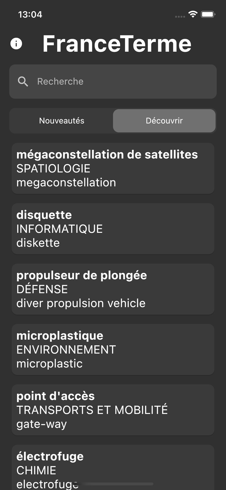
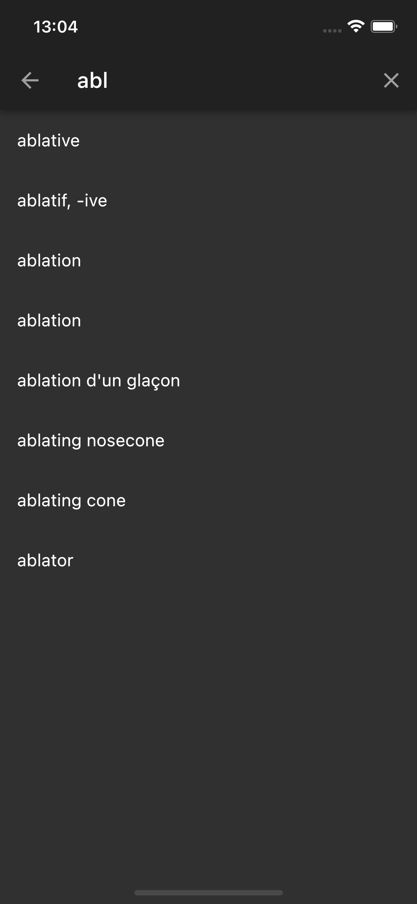
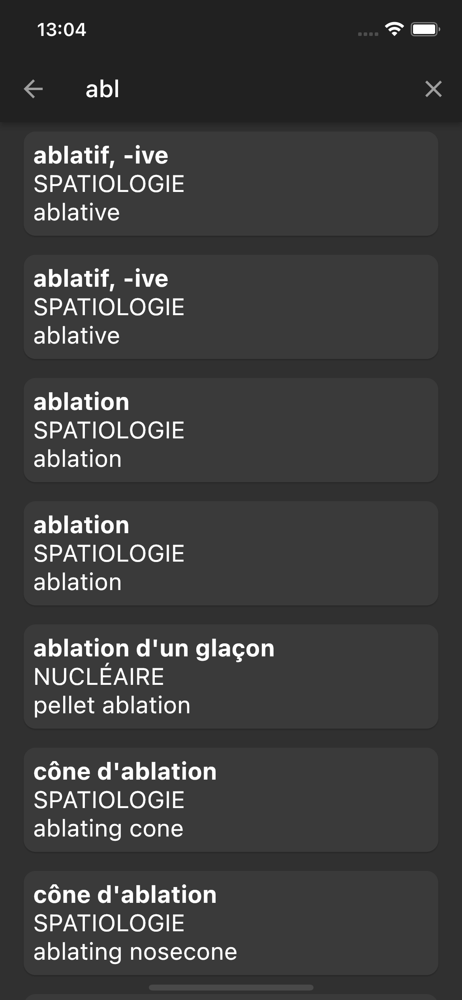
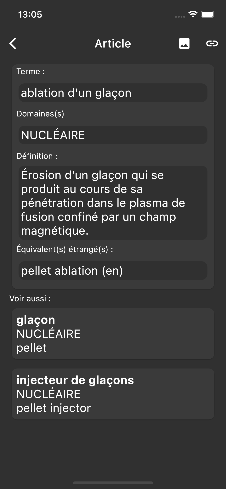

# France Terme

*[English Version](./README_EN.md)*

## Téléchargement

- TODO IOS 
- TODO ANDROID 

## Qu'est-ce que France Terme

À l'origine [France Terme](http://www.culture.fr/franceterme/) est un site maintenue par le ministère français de la Culture. \
Il le décrive ainsi :

>"Ce site est consacré aux termes recommandés par la Commission d'enrichissement de la langue française et publiés au Journal officiel de la République française [...] ne constitue en aucun cas un dictionnaire bilingue ou un dictionnaire de langue générale[...]."
[>lire tout<](http://www.culture.fr/Ressources/FranceTerme/Qui-sommes-nous)

Dans le cadre de la [mission Etalab](https://www.etalab.gouv.fr/qui-sommes-nous/) le ministère de la culture publie le [fichier source](https://data.culture.gouv.fr/explore/dataset/base-franceterme-termes-scientifiques-et-techniques/information/) des données dans le format XML. Ainsi il m'est venu à l'idée de crée cette application afin de rendre l'accès au service France Terme plus convivial.

Il s'agit donc d'une application pour téléphone permettant de lire la base de données France Terme, elle peut être utilisé pour découvrir les nouveaux mots ajouté, découvrir des mots aléatoirement et pour chercher la traduction de termes étrangés.

## Captures d'écran

### Version clair

### Version sombre

## Disclamer

Cette application est développer par un étudiant en informatique, il se peut qu'elle comporte des bugs, si vous en trouvez n'hesité pas à les faires remonter!
