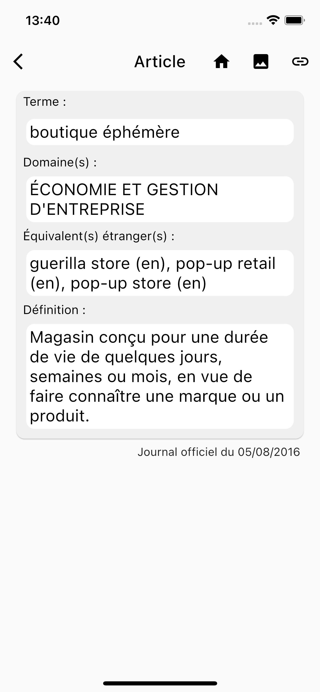
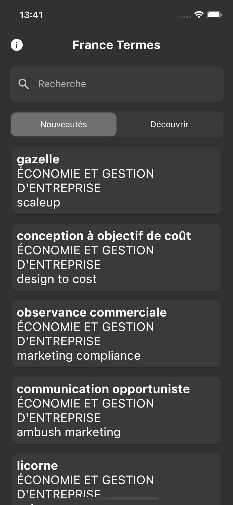
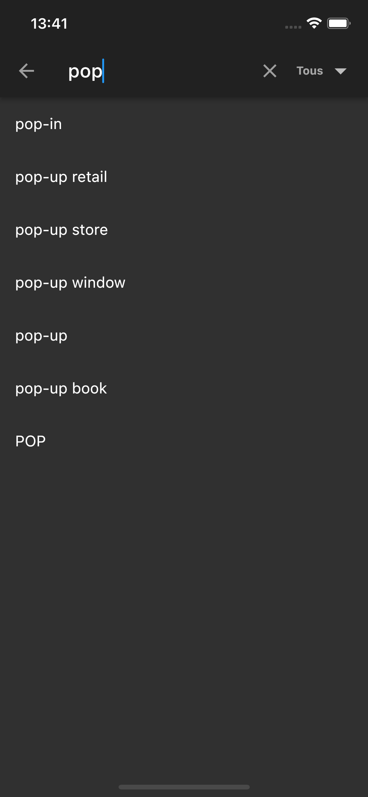

# France Termes

*[English Version](./README_EN.md)*

## Téléchargement

- [Iphone/Ipad](https://apps.apple.com/app/id1635325942)
- Android - En cours

## Qu'est-ce que France Terme

À l'origine [France Terme](http://www.culture.fr/franceterme/) est un site maintenu par le ministère français de la Culture. \
Il est décrit ainsi :

>"Ce site est consacré aux termes recommandés par la Commission d'enrichissement de la langue française et publiés au Journal officiel de la République française [...] ne constitue en aucun cas un dictionnaire bilingue ou un dictionnaire de langue générale[...]."
[>lire tout<](http://www.culture.fr/Ressources/FranceTerme/Qui-sommes-nous)

Dans le cadre de la [mission Etalab](https://www.etalab.gouv.fr/qui-sommes-nous/) le ministère de la Culture publie le [fichier source](https://data.culture.gouv.fr/explore/dataset/base-franceterme-termes-scientifiques-et-techniques/information/) des données dans le format XML. Ainsi il m'est venu à l'idée de créer cette application afin de rendre l'accès au service France Terme plus convivial.

Il s'agit donc d'une application pour téléphone permettant de lire la base de données France Terme, elle peut être utilisée pour découvrir les nouveaux mots ajoutés, découvrir des mots aléatoirement et pour chercher la traduction de termes étrangers.

## Description de l'application

Découvrez, cherchez et explorez les nouveaux termes de la langue française !
Régulièrement, la "Commission d'enrichissement de la langue française" invente de nouveaux mots pour nommer en français les réalités nouvelles et les innovations scientifiques et techniques, dans cette application vous retrouverez l'ensemble de ces nouveaux termes.

Fonctionnalités:

- Recherche de mots;
- onglet nouveauté, permettant de découvrir les nouveaux termes ajoutés;
- onglet découvrir, permettant de découvrir des termes aléatoirement;
- fonctionnement hors-ligne;
- transformation des articles en image et ainsi que le lien de chacun d'entre eux vers le site officiel de France Terme;
- Recherche de mise à jour automatique.

Information :
Les données utilisées par l'application sont fournies par le ministère de la culture français dans le cadre du programme de données ouvertes. Cette application est une proposition de réutilisation de ces données.

## Captures d'écran

### Version claire

### Version sombre

## Disclamer

Cette application est développée par un étudiant en informatique sur son temps libre, il se peut qu'elle comporte des bogues, dans ce cas ouvrer une « issues » ou contacté par [mail](#contact).

Le "s" de "France Termes" n'est pas une erreur !

## Licence

Le code de l'application est sous licence [MIT](./LICENSE) et le jeu de données est sous licence ouverte [Etalab](https://www.etalab.gouv.fr/wp-content/uploads/2017/04/ETALAB-Licence-Ouverte-v2.0.pdf).

## Contact

Mail :
<a href="mailto: contact@flris.fr">contact@flris.fr</a>.
