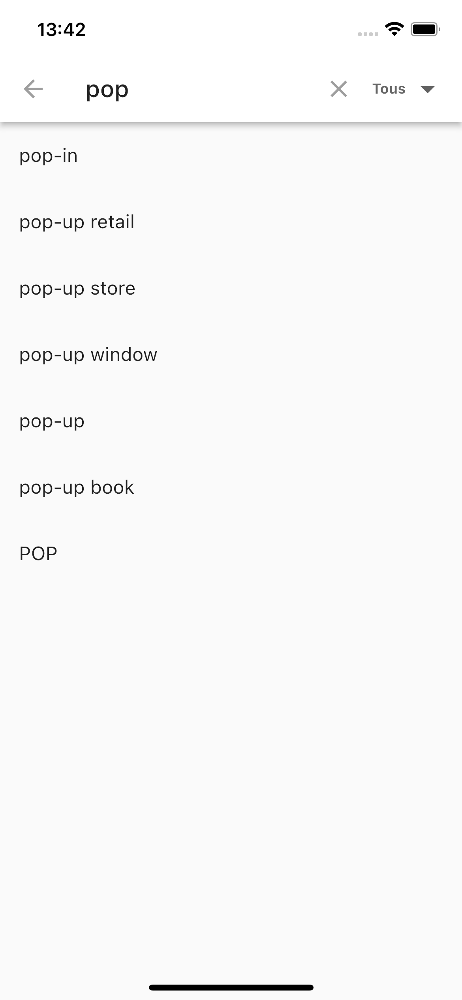
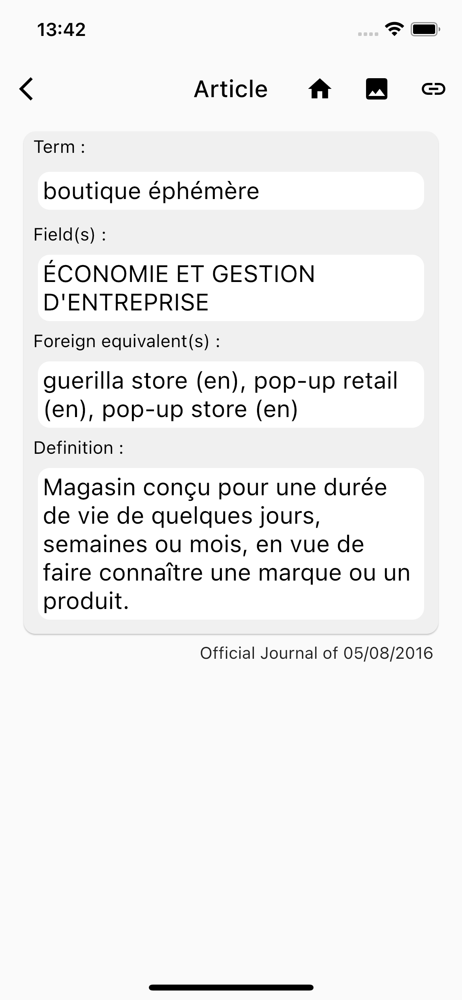
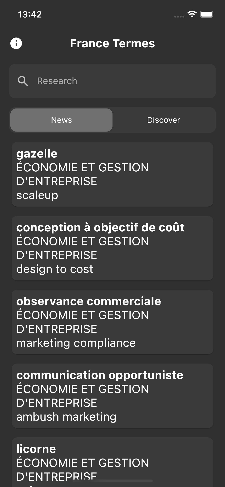

# France Termes

*[Version Française](./README.md)*

## Download

- TODO IOS 
- TODO ANDROID 

## What is France Terme

Originally [France Terme](http://www.culture.fr/franceterme/) is a website maintained by the French Ministry of Culture. \
It is described as follows:

>"This site is devoted to terms recommended by the Commission d'enrichissement de la langue française and published in the Journal officiel de la République française [...] is in no way a bilingual dictionary or a general language dictionary [...]."
[>read all<](http://www.culture.fr/Ressources/FranceTerme/Qui-sommes-nous)

Within the framework of the [mission Etalab](https://www.etalab.gouv.fr/qui-sommes-nous/) the Ministry of Culture publishes the [source file](https://data.culture.gouv.fr/explore/dataset/base-franceterme-termes-scientifiques-et-techniques/information/) of the data in XML format. So it came to my mind to create this application in order to make access to the France Terme service more user-friendly.

It is a phone application to read the France Terme database, it can be used to discover new words added, to discover words randomly and to search for the translation of foreign terms.

## Description of the application

Discover, search and explore the new terms of the French language!
Regularly, the "Commission d'enrichissement de la langue française" invents new words to name in French new realities and scientific and technical innovations, in this application you will find all these new terms.

Features:

- Word search;
- tab new, allowing to discover the new added terms;
- discover tab, allowing to discover terms randomly;
- offline operation;
- transformation of the articles into images and the link of each of them to the official site of France Terme;
- Automatic update search.

Information :
The data used by the application are provided by the French Ministry of Culture as part of the open data program. This application is a proposal to reuse these data.

## Screenshots

### Light theme

### Dark theme

## Disclamer

This application is developed by a student in computer science on his free time, it may have bugs, in this case open an "issues" or contact by [mail](#contact).

The "s" in "France Termes" is not a mistake!

## License

The application code is licensed under the [MIT](./LICENSE) license and the dataset is licensed under the [Etalab](https://www.etalab.gouv.fr/wp-content/uploads/2018/11/open-licence.pdf) open license.

## Contact

Mail :
<a href="mailto: contact@flris.fr">contact@flris.fr</a>.
